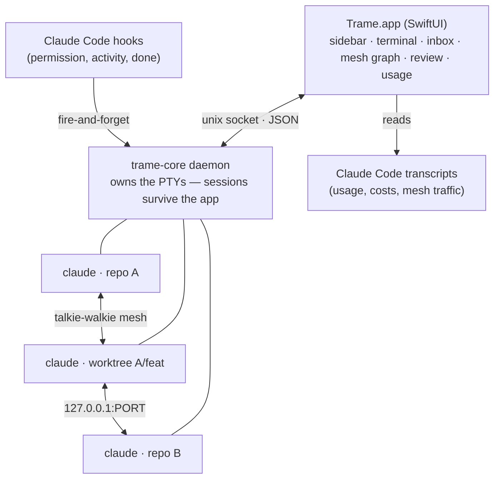

# Trame

**A native macOS cockpit for running multiple Claude Code agents in parallel.**

Trame turns the pain of juggling N terminals into a single, calm window: create
sessions on git repos or one-click worktrees, attach custom MCP servers with
Keychain-stored secrets, interconnect your agents through a
[talkie-walkie](https://github.com/cldt-fr/claude-talkie-walkie) mesh so they
can talk to each other, get notified the moment an agent needs you, review
their diffs natively, and track what it all costs.

> 🇫🇷 The full product spec lives in
> [docs/CAHIER_DES_CHARGES.md](docs/CAHIER_DES_CHARGES.md) (French).

## Highlights

- **Sessions that survive everything** — a background daemon (`trame-core`)
  owns the PTYs, so quitting the app, crashing, or rebooting never kills your
  agents; sessions are snapshotted and restored automatically.
- **One-click git worktrees** — run several agents on the same repo without
  conflicts: feature branch, reviewer and test-runner each get an isolated
  checkout under `~/.trame/worktrees`.
- **MCP library with real secret hygiene** — define a server once, attach it to
  any session; secret env vars live in the macOS Keychain and are injected at
  launch through `${VAR}` indirection — never written to disk, never in your
  repo (configs go through `--mcp-config` in Application Support).
- **Agent-to-agent mesh** — a toggle and a role name auto-provision
  [claude-talkie-walkie](https://github.com/cldt-fr/claude-talkie-walkie)
  (ports, shared secret, `PEERS`): your "dev" agent can ask your "reviewer"
  agent to check its diff. Interactive graph, live message inspector, remote
  peers on other machines, health probes.
- **Attention, not surveillance** — Claude Code hooks feed an inbox: permission
  requests and finished turns surface as macOS notifications, a Dock badge, a
  live menu-bar status (spinner + elapsed time while agents work), and an
  optional [ntfy](https://ntfy.sh) push to your phone.
- **Native git review** — the Changes tab diffs each session against its
  *starting commit* (not just HEAD), with commit / push / PR (`gh`) / worktree
  merge actions and honest guardrails (branches are never deleted).
- **Permission presets** — Prudent, Standard (`--allowedTools` allowlist), or
  Autonomous (`--dangerously-skip-permissions`) per session, with a permanent
  badge on autonomous sessions.
- **Multiple Anthropic accounts** — isolated `CLAUDE_CONFIG_DIR` per account,
  color-coded per session, so work and personal quotas never mix.
- **Usage & costs** — parsed from Claude Code's own transcripts: per-session
  estimate in the header, daily bar chart, per-model breakdown, daily spend
  alert.
- **⌘K everything** — command palette, ⌘1…9 session switching, keyboard-first.

## Architecture



The app binary doubles as the daemon (`Trame --daemon`) — there is nothing to
install. State detection never scrapes the terminal: hooks give real-time
events (permission asked, tool running, turn finished) and the JSONL
transcripts are the source of truth for history and costs.

## Requirements

- macOS 14+ (Apple Silicon)
- [Claude Code](https://claude.com/claude-code) CLI on your PATH
- `git` (bundled with Xcode CLT); `gh` optional for PR creation
- Node.js 20+ (`npx`) if you use the talkie-walkie mesh

## Build & run

```sh
git clone https://github.com/cldt-fr/trame.git
cd trame
open Trame.xcodeproj   # then ⌘R in Xcode
```

or from the command line:

```sh
xcodebuild -project Trame.xcodeproj -scheme Trame -configuration Debug build
```

## Tests

The core logic lives in a Swift package (`TrameCore/`) and is fully testable
headlessly:

```sh
cd TrameCore
swift test                     # unit tests (git, MCP config, usage parsing…)
swift build && .build/debug/trame-smoke   # end-to-end daemon test (20 checks)
```

The smoke test validates the flagship guarantee: sessions live in the daemon
and survive client disconnects, with scrollback replay and exit codes.

## Project layout

```
Trame/               SwiftUI app (views, stores, hook installer)
TrameCore/           Swift package
  Sources/CPTY          C shim (forkpty)
  Sources/TrameProtocol wire protocol (unix socket, JSON lines)
  Sources/TrameDaemon   the daemon: PTY sessions, scrollback, hooks
  Sources/TrameClient   control + attach clients
  Sources/TrameGit      git & worktree operations
  Sources/TrameMCP      MCP config generation (secret indirection)
  Sources/TrameUsage    transcript parsing: usage, costs, mesh traffic
  Sources/trame-core    standalone daemon executable
  Sources/trame-smoke   end-to-end test harness
docs/                The product spec (French)
```

## License

[MIT](LICENSE)
